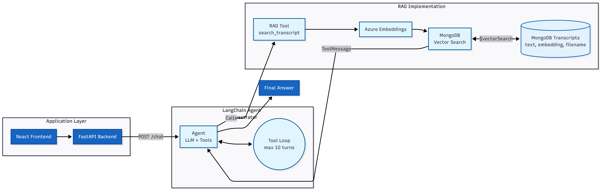

# IntelliMeet

Meeting Transcript Analyzer using RAG (Retrieval-Augmented Generation).

## Project Structure

- **backend/** - FastAPI server (Python)
- **frontend/** - React app
- **documents/** - Project plan, technical documentation, and architecture design prompt

## Demo

**[Watch the IntelliMeet demo video](documents/Intellimeet_recording.mp4)** *(click to play)*

## Architecture

### System Overview & Data Flow



### API Endpoints

| Method | Endpoint | Description |
|--------|----------|-------------|
| GET | `/` | API info + docs link |
| GET | `/health` | Connectivity check |
| POST | `/upload` | Upload .txt transcript |
| GET | `/files` | List indexed filenames |
| POST | `/ask-basic` | Simple LLM ping (Azure connectivity test) |
| POST | `/ask` | RAG query (global transcript search) |
| POST | `/chat` | File-scoped chat with LangChain agent + RAG tool |

### Components

| Component | Technology | Role |
|-----------|------------|------|
| Frontend | React 19 (CRA) | UI for upload, file selection, chat, RAG search |
| Backend | FastAPI | REST API, chunking, embeddings, RAG, chat |
| Embeddings | Azure OpenAI (text-embedding-ada-002) | 1536-d vectors for chunks and queries |
| LLM | Azure OpenAI (GPT) | Answer generation from RAG context and chat |
| Vector store | MongoDB Atlas | `transcripts` collection with vector index `vector_index` |
| Session store | In-memory dict | `_chat_memories`; ephemeral, not shared across workers |

### MongoDB Schema

**Collection:** `transcripts`

| Field | Type | Description |
|-------|------|-------------|
| `text` | string | Chunk text (~800 chars) |
| `embedding` | float[1536] | Vector from ADA model |
| `filename` | string | Source file name |

**Index:** `vector_index` - Vector search index on `embedding`, cosine similarity, 1536 dimensions.

### Architecture Characteristics

- **Single process:** Backend runs as one uvicorn process (no horizontal scaling).
- **Synchronous upload:** Large files may cause timeouts; embedding calls block the request.
- **Stateless API (except chat):** Only `/chat` keeps state (`_chat_memories`).
- **File-scoped RAG:** Chunks filtered by `filename`; chat and RAG tool operate per-file.
- **No auth:** No authentication or authorization implemented.

## Quick Start (Step 1)

### 1. Backend Setup

```bash
cd backend

# Create virtual environment (already done if following setup)
uv venv .venv

# Activate (Windows PowerShell)
.\.venv\Scripts\Activate.ps1

# Install dependencies
uv pip install -r requirements.txt

# Copy .env.example to .env and fill in your values
copy .env.example .env

# Run the server
uvicorn main:app --reload --host 0.0.0.0 --port 8000
```

### 2. Frontend Setup

```bash
cd frontend
npm install
npm start
```

### 3. Manual: Create `.env`

Copy `backend/.env.example` to `backend/.env` and set:

- `AZURE_OPENAI_KEY` - Your Azure OpenAI API key
- `AZURE_OPENAI_ENDPOINT` - Base URL (e.g. `https://your-resource.openai.azure.com`)
- `AZURE_OPENAI_DEPLOYMENT_NAME` - Chat model deployment name
- `AZURE_OPENAI_EMBEDDING_DEPLOYMENT_NAME` - Embedding model deployment (e.g. `text-embedding-ada-002`)
- `AZURE_OPENAI_API_VERSION` - Use `2025-04-01-preview` for Responses API
- `MONGO_URI` - MongoDB Atlas connection string (required for Step 2+)

### 4. MongoDB Vector Search Index (required for upload / RAG)

In MongoDB Atlas, create a **Vector Search Index** on the `transcripts` collection:

1. Go to your cluster -> Browse Collections -> `meeting_analyzer_db` -> `transcripts`
2. Search Indexes -> Create Search Index -> JSON Editor
3. Use this definition (index name: `vector_index`):

```json
{
  "fields": [
    {
      "numDimensions": 1536,
      "path": "embedding",
      "similarity": "cosine",
      "type": "vector"
    }
  ]
}
```

## Q&A

### What would be required to productionize your solution, make it scalable and deploy it on a hyper-scaler such as AWS?

Upload the file and store it in S3, which will trigger a Lambda to do the chunking and embedding, finally storing it in MongoDB (serverless approach). Containerize and build Docker images, push to ECR, and deploy to ECS.

### RAG/LLM approach & decisions: Choices considered and final choice for LLM / embedding model / vector database / orchestration framework, prompt & context management, guardrails, quality, observability

**Key technical decisions you made and why:**

I've chosen Python FastAPI since it's one of the best frameworks to create APIs easily, and React because Cursor could help me build the React frontend easily?it comes with libraries to show markdown formats in UI. Can also help integrate authentication easily in future versions. Using OpenAI for LLM and RAG is just a personal preference but wasn't necessary.

**Engineering standards you've followed (and maybe some that you skipped):**

*Considered:*
- Stateless API which doesn't save chat history.
- Backend runs as a single uvicorn process.

*Skipped:*
- No authorization and authentication implemented.
- How to process large files?it might cause timeout errors.
- Didn't add voice-to-transcript functionality yet.

**How you used AI tools in your development process:**

Upon deciding the project I want to make, the first step was to decide the tech stack I want to use. The initial step was to prepare a detailed technical documentation which would outline the tech stack I want to use and how I want to use those. I used Gemini to lay out the technical documentation for the project (IntelliMeet).

Secondly, I wanted to create a Project Plan document?the idea here was to leverage Gemini to give me the detailed steps which would be needed for project development.

I used Cursor as my development tool. Although I have used very specific Cursor rules to make it follow my development plan and scope strictly?my certain guidelines and preferred development and build strategy, folder structure, etc.

**Entire thought process and the tech stack chosen:**

We wanted to first start with just uploading a single file and checking if the embeddings are happening correctly or not, and whether we're getting output from the LLM. Post that we proceeded to LangChain, where my intention was to upload multiple files and then chat on the files we select. Here we can leverage the agent feature so that the main Orchestrator can understand if it has the context of the file for which the question is being asked; if not, it would do a tool call to do a RAG search and fetch the output to the UI.

**What you'd do differently with more time:**

- I would try to keep the history for a given file if the user selects clearing history and starting a fresh chat.
- We can limit the file size as well (less than 10MB).
- We can apply the authentication mechanism.
- I'd like to implement streaming to visualize what is happening on the server side in real time?e.g. processing/embedding of file, tool calling during generating response, etc.
- Some more changes to the UI to make it look more engaging.

**Edge cases:**

If you ask the bot "What is the capital of India?", it replies with "Delhi." But when you ask "What is the current timestamp?", it says "I don't have access to your device's real-time clock." Basically, the limitation of the backend orchestrator is limited by the tools it has access to. Also, since the LLM comes after the RAG operation and the context of the LLM is only the filtered/fetched chunks, there might be chances of missing context.

## Running the App

1. Start the backend: `cd backend && uvicorn main:app --reload --port 8000`
2. Start the frontend: `cd frontend && npm start`
3. Open http://localhost:3000 - upload a .txt transcript, then use Ask Basic or Search (Step 3).
